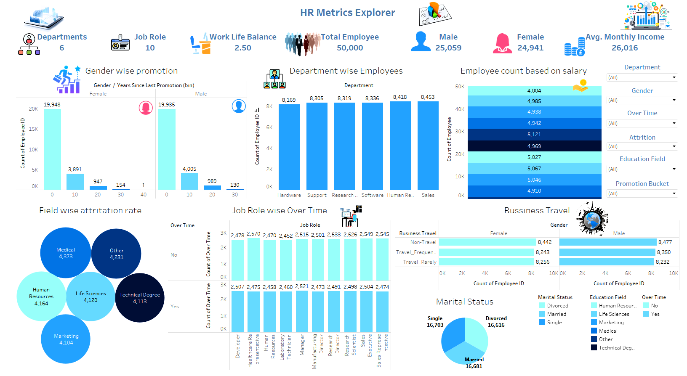
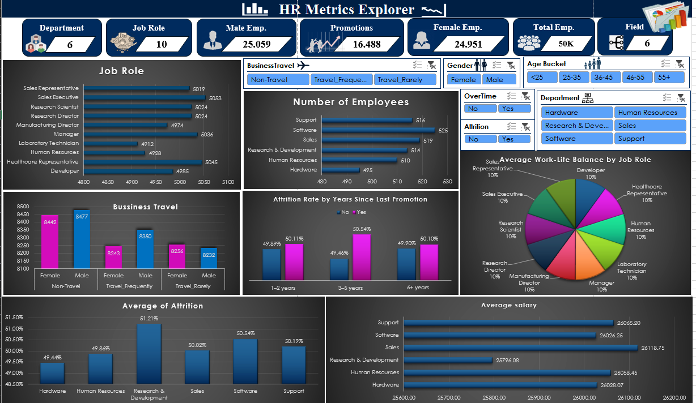

# 👥 HR Analytics Project  
A complete analysis of workforce metrics using Excel, SQL, Tableau & Power BI

This project provides insights into employee attrition, departmental trends, satisfaction scores, and performance analytics based on HR data. By using **Excel**, **Power BI**, **Tableau**, and **SQL**, the analysis aims to support strategic HR decision-making, talent retention, and workforce planning.

---

## 📊 Tools & Technologies Used

- 🟩 **Excel** – Exploratory data analysis, pivot tables, summary reports
- 📘 **Power BI** – Interactive dashboards for attrition, satisfaction, salary distribution
- 🔵 **Tableau** – Visual storytelling with department-wise and gender-based insights
- 🟡 **SQL** – Data preprocessing, joins, aggregations, and employee segmentation

---

## 🧩 Dashboard Gallery

### 📍 Power BI Dashboard

**Key Insights:**
- **Overall Attrition Rate**: 16%
- **Most affected departments**: Sales and HR
- High attrition among employees with **<3 years** of experience
- **Work-life balance** and **job satisfaction** strongly impact attrition
- Gender disparity in some departments, notably **Technical**

---

### 📍 Tableau Dashboard

**Highlights:**
- Heatmaps and bar charts for **department-wise attrition**
- Filterable by **education, experience, gender**, and **job role**
- **Attrition rate** trends over time visualized clearly
- Pie charts show **salary range** and **job satisfaction levels**

---

### 📍 Excel Dashboard

**Insights from Excel Dashboard:**
- Dynamic dashboard using slicers for **age**, **department**, and **education**
- **Average satisfaction score**: 3.4/5
- **Job role vs. attrition** comparison using conditional formatting
- Pivot analysis of **monthly income vs. attrition rate**

---

## 🎯 Analytical Objectives

- Identify factors contributing to employee attrition
- Analyze salary distribution across departments and job roles
- Track employee satisfaction and work-life balance metrics
- Highlight trends by gender, education, and experience levels
- Build a data-driven strategy for employee engagement and retention

---

## 📌 Keywords

`#HRAnalytics` `#EmployeeAttrition` `#PowerBI` `#Tableau` `#ExcelDashboard`  
`#SQLQueries` `#WorkforceInsights` `#EmployeeEngagement` `#DataDrivenHR` `#BIProject`

---

## 👨‍💻 Author

**Shivu G M**  
📧 sgm8762@gmail.com  
📍 Bengaluru, India  
🔗 [LinkedIn](https://www.linkedin.com/in/shivu-g-m)
"""

